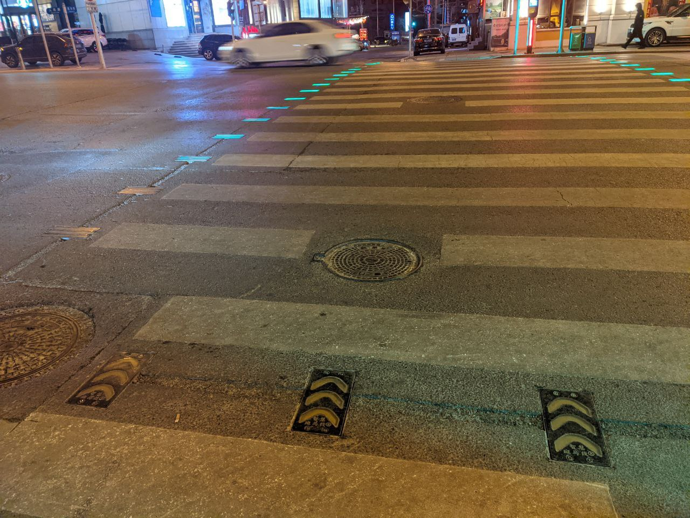
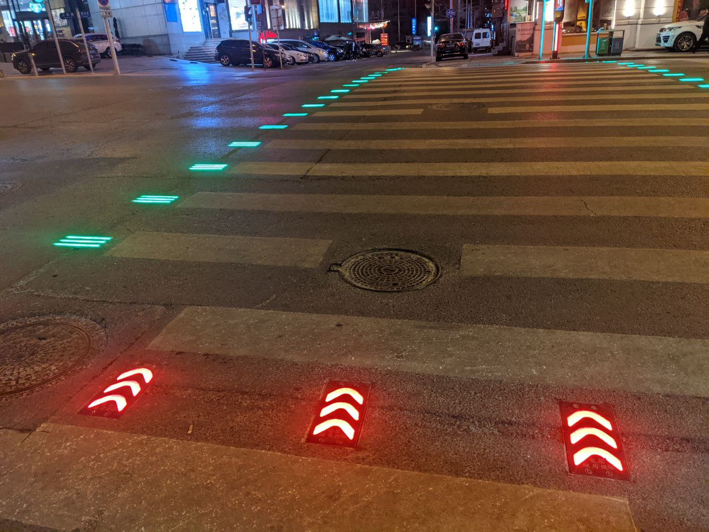
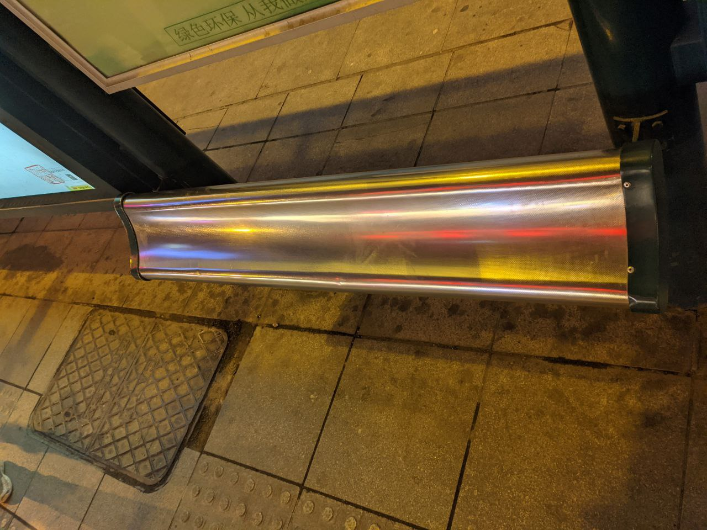
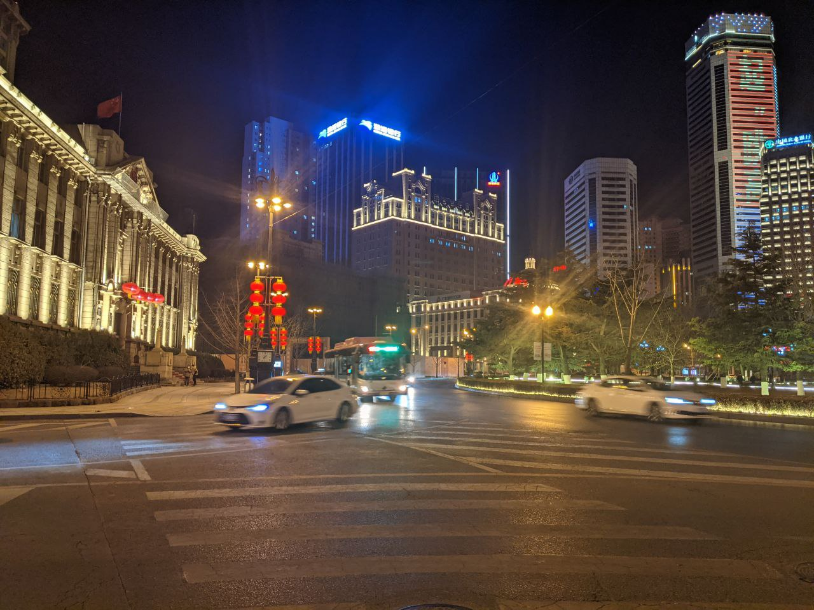
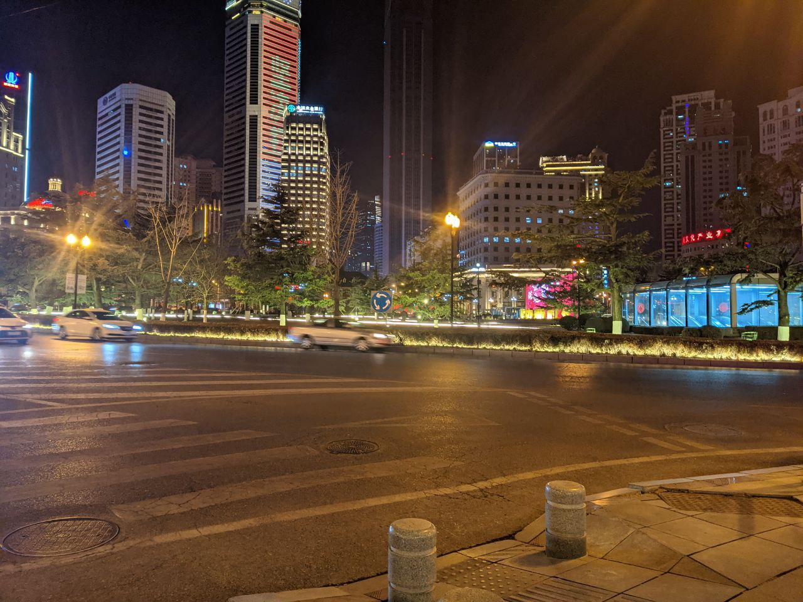
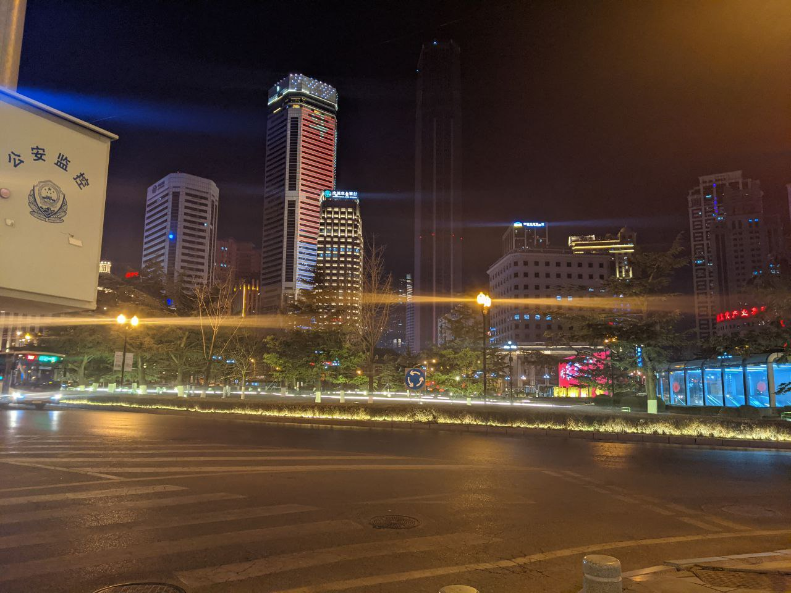
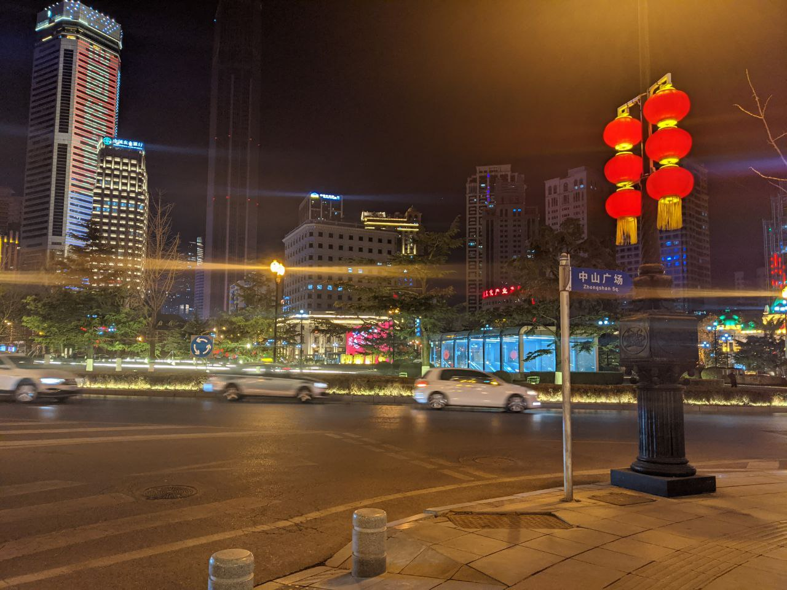
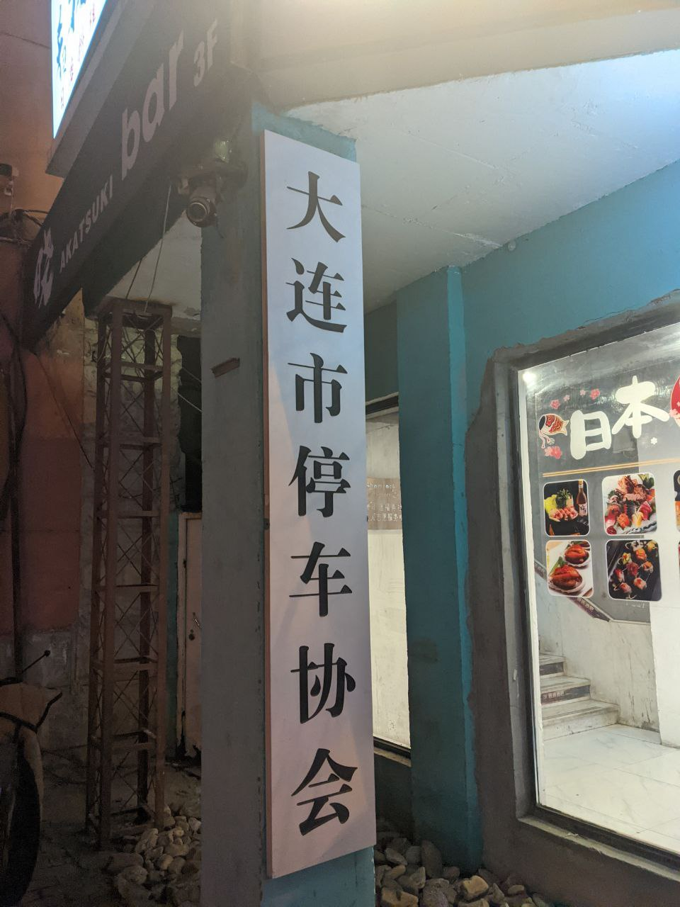
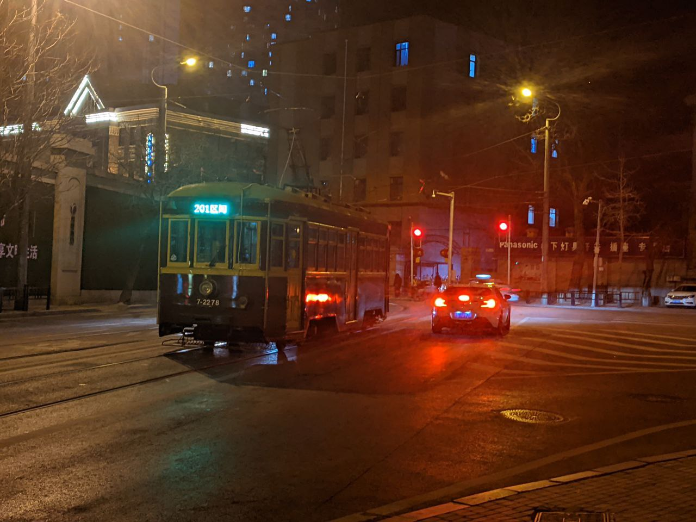

## 日报 / 1月29日 / Daily #3

en.. 昨天发生了特殊且离谱的事情，并且自己似乎失去了半个整天的记忆.. 也想要写一篇记录说一下这个遗过性丧失的事情，不过后来应该是晕过去了还是什么.. 就没能交上去，也因为笔记本耗尽电量关机，文件也丢掉了==  

粗略地算了一下可能过去的四天加在一起也没有睡够10h... 今天已经是在集训的城市过夜了，超级害怕明天会睡过&... 
然后在写到这里的时候找了好多人，想要让大家在七点的时候帮忙打电话叫醒一下... 然后发现大家的起床时间都魔幻地一致在了九点...// 
aaaa所以要怎么办.. 救命&!  

可能这大概是自己不知道第多少次来到大连了... 应该是第六次？不过感觉还是完全没有见过二线城市的好多东西， 现在在的地方离学校有475km... 即使是上午十点钟就出发，全程没有堵塞的高速公路也赶到了下午三点半的时候才勉强到达... ~~虽然中途在服务区里摸了一会鱼 不过不摸鱼就要在那个区间超速了.. 这只笨蛋没有看到区间终点就迎来了下一个起点 幸好区间里面有一个服务区&.&~~  

然后住的地方各种意义上的还不错..不管是条件还是卫生都还算是比较棒的级别，不过从已经被按出痕迹的空调控制面板和大量松脱的插座来看也是一家很老的店了，但是得益于超级适合长使用年限的装修设计风格，不管从什么角度上这家店现在的条件都已经超级棒了&—  

晚上的时候出去熟悉了一下周围的环境，然后惊喜地发现这里距离集训的地方只有100m！... 然后周围50m的半径内有至少五家餐馆，500m半径内至少有50家餐馆，而且日式料理店占绝对的大多数，还有至少两座商超五家24小时便利店... 24小时便利店这种东西在我们的新五线城市中是完完全全见不到的，这次真的对城市的繁华体现在晚上有了超级深的实感了...   

不过更深的实感其实是.. 
二线城市的物价好恐怖a！去商超里看了看 一个普普通通的塑料桶已经可以卖到40~50元了... 隔着窗户看了两家餐馆 烤串什么的更是已经贵到了5CNY一串.. 完全无法想象在这样城市的生活... 互联网经济还是没有地域限制的，也就是说.. 以自己的工作能力或者什么的，大概是完全无法支撑在大城市活着的吧..  

还有看到了好多好玩的东西... 比如公交站牌下有等车的时候可以坐的小椅子，见到了像是方块学园3中的红石城中心一样的广场，有轨电车，「大连市停车协会」，甚至智能斑马线... 什么的这些东西  

最后大概熟悉了环境回去以后.. 还用笔记本试图在创群语音，画了一点尺子的电源轨.. 然后被创群的朋友~~生气地~~在十点就叫去睡觉，然而现在已经又过去了两三个小时了...   

然后回来的路上还有看到一家McD.. 想起前几天身边的一位朋友在家里跑路被迫在McD过夜..自己陪着也挂语音和聊天到了蛮晚的时候 还整理了半份McD的BGM歌单... 
然后现在就在认真地筹备想要在McD过一夜了，更多地是也想体验一下那样的感觉... 想要 自己去感受一下大家都在承受着的东西吧
  

en.. 明天早上七点就还要起来去集训，所以.. 晚安之前贴点图好啦~& 
1636字 是最短的一期了呢...   

