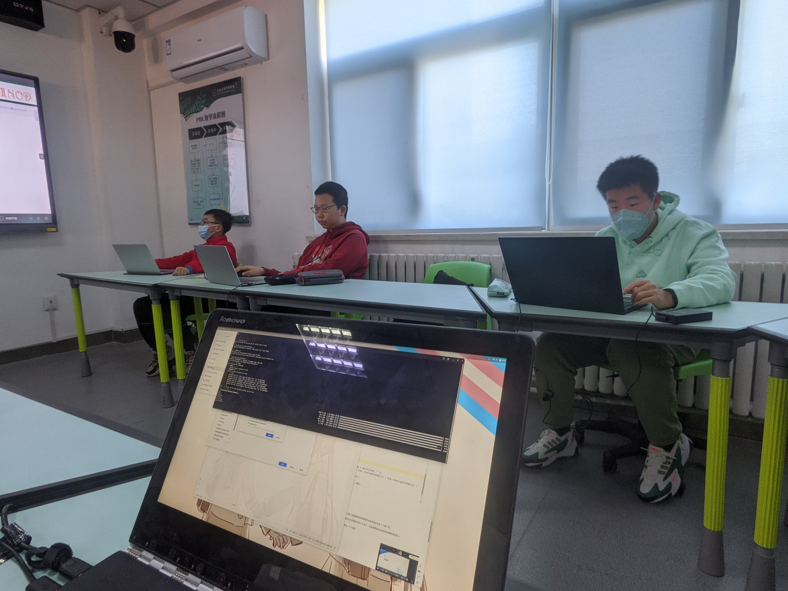

## 日报 / 1月30日 / Daily #4
被集训，图纸，日记填满的一天，还有超级好玩的事情...<br><br>

首先就是发现回去的车票只剩下四张了... 然后就开始以最高的效率画板还是没能画完，如果真的攒不到的话，就.. 应该需要和好多人借不少的&.&<br><br>

然后集训就比较很无聊了.. 唯一的小插曲就是写出了一个Segmentation Fault，把老师和所有同学都弄晕了... 和老师趴在电脑前调试了超级久，结果就有了超级出戏的一幕：<br>
开着CMake的Debug编译模式下，点运行就会Segmentation Fault，点调试就会Misbehaviour但是会正常地跑下去... 然后一位老师看了一下代码，成功地修掉了Misbehaviour(引发错误的原因是冒号迭代循环里面的是值不是key)，但Segmentation Fault一直存在.<br>
又过了五分钟，我们开始二分法注释代码，直到Segmentation Fault消失，在最后被注释掉的逻辑代码上下了一个断点，然后事情就水落石出了.<br><br>
`original[5] int : {-8118, 4, 3, 1, 2, 0}`<br><br>
脏变量了。<br><br>

```
语法老师：啊？脏变量啦？她把数组放哪里了啊
算法老师：呃... 局部
语法老师：哦我们平时都是开全局数组... 所以就没想那个脏变量的问题
算法老师：对，到时候你就开全局数组吧
     我：那不是就拿不到n了吗 (读入的数组尺寸)
算法老师：你估算嘛，估算就行了，反正能跑就行
     我：程序和我人 只要有一个能跑就行对吧？
语法老师：啊对对对
```
<br><br>

然后上午写着代码的时候被朋友来问了一些事情.. 于是突然临时起意想起来 有一位关系还不错的群友是在这座集训的城市的... 于是就临时起意去面了（hae...<br>
被送了一盒签名的补子，然后.. 仅仅是在星巴克坐了一会，玩了一会iPad..什么的.?<br><br>

~~最离谱的是自己跟着她走了200m的路程，小腿的肌肉就完全痉挛了... 更加魔幻的是不超过两个小时就甚至开始发展到手上的关节了&.&~~

现在是2:49 AM... 正在创群语音，眼睛很痛.. 所以可能 贴几张图就这样结束嘛.. 想要凹也凹不出来的话.


